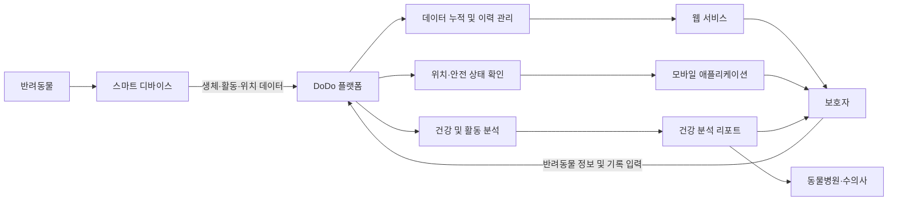
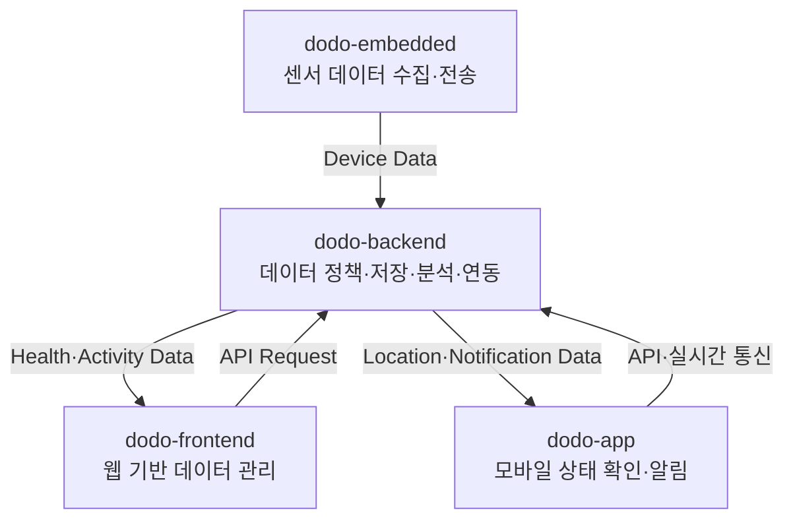

# DoDo

### 반려동물의 건강과 안전을 데이터로 연결하는 통합 펫 케어 플랫폼

반려동물의 생체·활동·위치 데이터를 수집하고 분석하여
보호자가 건강 상태와 안전 정보를 지속적으로 확인할 수 있도록 지원합니다.

 

<!-- 서비스 대표 이미지가 준비되면 아래 주석을 해제하세요. -->

<!--

-->

---

## 프로젝트 개요

| 구분      | 내용                                           |
| ------- | -------------------------------------------- |
| 프로젝트명   | DoDo                                         |
| 프로젝트 기간 | 2025.10 ~ 2026.08                            |
| 프로젝트 형태 | IoT 디바이스 연계 반려동물 헬스케어 플랫폼                    |
| 주요 사용자  | 반려동물 보호자, 노령견·만성질환 반려동물 보호자, 동물병원            |
| 핵심 목표   | 반려동물의 건강과 안전 상태를 객관적인 누적 데이터로 관리할 수 있는 환경 구축 |

---

## 프로젝트 배경

반려동물은 자신의 건강 상태나 이상 징후를 직접 표현하기 어렵습니다.

보호자는 식사량, 움직임, 행동 변화 등을 관찰하여 상태를 판단하지만, 이러한 방식은 보호자의 경험과 주관적인 판단에 의존합니다. 눈에 띄는 증상이 나타난 뒤에야 문제를 인지하는 경우도 많으며, 병원 진료 시 평소 상태를 객관적으로 설명할 수 있는 자료가 부족하다는 한계도 존재합니다.

또한 반려동물 관련 서비스는 위치 추적, 산책 기록, 건강 관리가 각각 분리되어 있어 보호자가 여러 서비스와 기기를 함께 사용해야 하는 불편함이 있습니다.

DoDo는 이러한 문제를 해결하기 위해 하드웨어에서 수집한 데이터를 웹과 모바일 서비스로 연결하고, 반려동물의 일상적인 변화를 하나의 흐름 안에서 관리하는 통합 펫 케어 플랫폼을 개발하고 있습니다.

---

## DoDo가 해결하려는 문제

### 관찰에 의존하는 건강 관리

보호자가 기억하거나 직접 기록한 정보만으로는 반려동물의 장기적인 변화를 객관적으로 확인하기 어렵습니다.

DoDo는 활동, 심박, 체온, 몸무게와 같은 데이터를 지속적으로 축적하여 시간에 따른 변화를 확인할 수 있도록 합니다.

### 분리된 건강·산책·안전 정보

건강 기록과 위치 기록이 서로 다른 서비스에 분산되면 반려동물의 전체 생활 패턴을 파악하기 어렵습니다.

DoDo는 건강, 활동, 산책, 위치 정보를 반려동물 단위로 연결하여 보호자가 하나의 서비스에서 확인할 수 있도록 구성합니다.

### 실시간 안전 대응의 어려움

반려동물이 보호자가 지정한 생활 반경을 벗어나더라도 즉시 인지하지 못하면 실종이나 사고로 이어질 수 있습니다.

DoDo는 디바이스에서 전달된 위치 데이터와 보호자가 설정한 안전 구역을 비교하여 위험 상황을 빠르게 전달하는 것을 목표로 합니다.

### 진료에 활용할 객관적인 기록 부족

병원 진료에서는 보호자의 설명에 의존하는 경우가 많아 평소 상태와 이상 발생 시점을 정확하게 전달하기 어렵습니다.

DoDo는 누적된 건강 및 활동 데이터를 리포트 형태로 정리하여 보호자와 수의사가 상태 변화를 확인할 수 있도록 지원합니다.

---

## 서비스 핵심 가치

### Data-driven Care

보호자의 기억이나 단편적인 관찰이 아니라 지속적으로 축적된 데이터를 기반으로 반려동물의 상태를 확인합니다.

### Continuous Monitoring

특정 시점의 측정 결과에 그치지 않고 일간·주간·월간 기록을 연결하여 장기적인 변화를 관리합니다.

### Integrated Experience

디바이스, 서버, 웹, 모바일 애플리케이션을 하나의 데이터 흐름으로 연결하여 분산된 펫 케어 경험을 통합합니다.

### Proactive Safety

문제가 발생한 뒤 기록을 확인하는 방식에서 나아가 위치 이탈이나 이상 징후를 빠르게 인지할 수 있는 구조를 지향합니다.

---

## 서비스 이용 흐름

DoDo의 각 저장소는 위 흐름의 특정 영역을 담당하며, 공통된 반려동물 데이터를 중심으로 연결됩니다.

---

## 서비스 구성

### 스마트 디바이스

반려동물에게 착용하는 목걸이 또는 하네스 형태의 디바이스입니다.

센서를 통해 반려동물의 생체·활동·위치 데이터를 수집하고, 서비스가 활용할 수 있는 형태로 전달하는 역할을 담당합니다.

### 데이터 플랫폼

디바이스와 사용자로부터 전달된 데이터를 검증하고 반려동물 단위로 축적합니다.

인증, 데이터 관계, 실시간 이벤트, 외부 서비스 연동과 같은 공통 정책을 관리하며 웹과 모바일 애플리케이션에 일관된 데이터를 제공합니다.

### 웹 서비스

보호자가 반려동물의 누적 건강 데이터, 활동 변화, 산책 기록과 서비스 정보를 넓은 화면에서 확인하고 관리할 수 있는 환경을 제공합니다.

### 모바일 애플리케이션

보호자가 장소와 시간에 구애받지 않고 반려동물의 현재 상태와 주요 알림을 확인할 수 있도록 지원합니다.

---

## Repository Guide

DoDo는 각 영역의 책임과 개발 환경을 분리하기 위해 여러 저장소로 운영됩니다.

| 저장소                                                            | 담당 영역         | 설명                                                |
| -------------------------------------------------------------- | ------------- | ------------------------------------------------- |
| [dodo-backend](https://github.com/DoDo-Project/dodo-backend)   | Data Platform | 사용자, 반려동물, 디바이스와 서비스 데이터를 연결하고 공통 비즈니스 정책을 관리합니다. |
| [dodo-frontend](https://github.com/DoDo-Project/dodo-frontend) | Web Client    | 보호자가 반려동물의 누적 정보와 서비스 기능을 웹에서 이용할 수 있도록 구성합니다.    |
| [dodo-app](https://github.com/DoDo-Project/dodo-app)           | Mobile Client | 실시간 상태 확인과 알림 등 모바일 중심의 사용자 경험을 제공합니다.            |
| [dodo-embedded](https://github.com/DoDo-Project/dodo-embedded) | IoT Device    | 센서 데이터를 수집하고 플랫폼으로 전달하는 하드웨어 및 통신 영역을 담당합니다.      |

각 저장소의 구체적인 구현 기능, 기술 스택, 내부 구조와 개발 규칙은 해당 저장소의 README에서 확인할 수 있습니다.

---

## 시스템 책임 분리

저장소는 독립적으로 개발되지만 API 명세와 데이터 계약을 기준으로 연결됩니다.

---

## 주요 사용자

### 일상적인 건강 관리가 필요한 보호자

반려동물의 활동량과 건강 기록을 지속적으로 확인하고 생활 패턴의 변화를 관리하려는 사용자입니다.

### 노령견·만성질환 반려동물 보호자

단기적인 상태뿐 아니라 장기간 누적된 데이터를 바탕으로 세밀한 관리가 필요한 사용자입니다.

### 반려동물의 안전에 민감한 보호자

산책이나 외부 활동 중 반려동물의 위치와 안전 구역 이탈 여부를 빠르게 확인하려는 사용자입니다.

### 동물병원 및 수의사

보호자의 설명뿐 아니라 누적된 활동 및 건강 데이터를 참고하여 반려동물의 상태를 파악하려는 사용자입니다.

---

## 프로젝트 차별점

### 하드웨어와 소프트웨어의 직접 연결

일반적인 기록형 서비스와 달리 사용자가 직접 입력한 정보뿐 아니라 디바이스에서 수집된 데이터를 함께 활용합니다.

### 반려동물 중심의 통합 데이터

건강, 활동, 위치, 산책 데이터를 개별 기능으로 관리하지 않고 하나의 반려동물 프로필을 중심으로 연결합니다.

### 과거 기록을 활용하는 분석

특정 시점의 수치만 보여주는 것이 아니라 이전 기록과 현재 기록을 비교하여 변화의 맥락을 확인할 수 있도록 합니다.

### 실시간 안전 관리와 장기 건강 관리의 결합

실시간 위치 확인과 장기적인 건강 데이터 분석을 하나의 플랫폼 안에서 제공하는 것을 목표로 합니다.

### 웹·모바일 환경의 역할 분리

웹에서는 누적 데이터의 조회와 관리에 집중하고, 모바일에서는 현재 상태 확인과 즉각적인 알림 경험에 집중합니다.

---

## 팀원 소개

<table align="center">
  <tr>
    <td align="center" width="180">
      <a href="https://github.com/WhiteBin-bin">
        
         
        <b>백현빈</b>
      </a>
       
      Project Lead · Backend
    </td>
    <td align="center" width="180">
      <a href="https://github.com/limhb708">
        
         
        <b>임현빈</b>
      </a>
       
      Backend
    </td>
    <td align="center" width="180">
      <a href="https://github.com/sooloin">
        
         
        <b>조수빈</b>
      </a>
       
      Frontend · Design
    </td>
    <td align="center" width="180">
      <a href="https://github.com/right-path-ptj">
        
         
        <b>박태정</b>
      </a>
       
      Embedded
    </td>
    <td align="center" width="180">
      <a href="https://github.com/anmincheol-71">
        
         
        <b>안민철</b>
      </a>
       
      Embedded
    </td>
  </tr>
</table>

 

| 이름  | 담당 역할                                                 |
| --- | ----------------------------------------------------- |
| 백현빈 | 프로젝트 총괄, 백엔드 아키텍처 및 보안 정책, 핵심 도메인, AI 분석 연동, 서버 배포 관리 |
| 임현빈 | 커뮤니티·관리자·알림 영역 개발, API 문서화 및 기능 검증                    |
| 조수빈 | 서비스 디자인, 웹·모바일 화면 개발, UI/UX 및 프론트엔드 배포 관리             |
| 박태정 | 디바이스 데이터 수집·전송 테스트 및 실시간 데이터 연동 지원                    |
| 안민철 | 센서 선정, 하드웨어 프로토타입 제작 및 디바이스 안정성 개선                    |

---

## 협업 방식

### 명세 기반 개발

프론트엔드, 백엔드와 하드웨어가 동일한 데이터 구조를 사용할 수 있도록 API 명세와 기능 명세를 기준으로 개발합니다.

### 이슈 단위 작업 관리

기능을 작업 가능한 단위로 분리하고 GitHub Issue를 통해 담당자, 진행 상태와 변경 범위를 관리합니다.

### Pull Request 기반 검토

모든 변경 사항은 Pull Request를 통해 공유하며, 구현 내용과 영향 범위를 확인한 후 통합합니다.

### 산출물 중앙 관리

기능 명세, API 문서, 데이터 모델, 디자인과 회의 내용을 공유 문서로 관리하여 팀 간 정보 불일치를 줄입니다.

### 단계별 통합 검증

각 저장소의 개별 기능 검증뿐 아니라 디바이스 데이터 수집부터 사용자 화면 출력까지 전체 흐름을 기준으로 통합 테스트를 진행합니다.

---

## 프로젝트 일정

| 단계       | 기간                | 주요 목표                           |
| -------- | ----------------- | ------------------------------- |
| 기획 및 설계  | 2025.10 ~ 2025.11 | 요구사항, 서비스 구조, API와 화면 흐름 설계     |
| 기반 기능 개발 | 2025.12 ~ 2026.02 | 디바이스 프로토타입 및 서비스 핵심 데이터 구조 구축   |
| 핵심 기능 연동 | 2026.03 ~ 2026.05 | 위치·안전·산책·활동 데이터 통합 및 서비스 화면 연동  |
| 분석 기능 개발 | 2026.06           | 누적 데이터를 활용한 건강 분석 구조 구현         |
| 최종 통합    | 2026.07           | 전체 시스템 배포 및 통합 테스트              |
| 안정화      | 2026.08           | 운영 상태 점검, 보안 검토, 버그 수정 및 데이터 백업 |

---

## 문서 안내

프로젝트의 구현 세부 내용은 각 저장소에서 확인할 수 있습니다.

* 백엔드 API와 데이터 처리 구조: [dodo-backend](https://github.com/DoDo-Project/dodo-backend)
* 웹 화면 및 사용자 경험: [dodo-frontend](https://github.com/DoDo-Project/dodo-frontend)
* 모바일 애플리케이션: [dodo-app](https://github.com/DoDo-Project/dodo-app)
* 하드웨어 및 센서 구성: [dodo-embedded](https://github.com/DoDo-Project/dodo-embedded)

---
